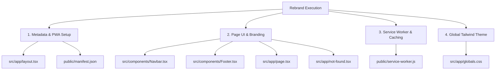

# Design Specification: Rebranding to Entqha (انطقها)

**Date:** 2026-07-04  
**Status:** Approved  
**Topic:** Rebranding of Sema3ny to Entqha (انطقها) & Theme System Implementation

---

## 1. Executive Summary & Brand Direction
The goal of this project is to completely rebrand the existing English Vocabulary Guide application from **Sema3ny** into **Entqha (انطقها)**.

*   **Brand Meaning:** Inspired by the Egyptian Arabic phrase **"انطقها"** ("Pronounce it").
*   **Design Aesthetics:** Premium EdTech product look and feel. Minimalist, clean, elegant, with generous whitespace, subtle borders, and smooth animations.
*   **Primary Accent:** Rich royal purple (`#6D28D9`) replacing the old teal theme.
*   **Logo Treatment:** Standalone branding via `nav-logo.png` in headers, `logo.png` in heroes, and `app-icon.png` in favicons.

---

## 2. Structural Scope & File Changes

The rebrand will touch the following areas of the codebase:



---

## 3. Section-by-Section Specifications

### Section 1: Metadata & Layouts

#### `src/app/layout.tsx`
*   **Title Metadata:** `EntQha (انطقها) - English Vocabulary Guide`
*   **Description Metadata:** `Master English vocabulary and pronunciation with EntQha (انطقها) through interactive word cards and text-to-speech.`
*   **Apple Web App Config:**
    *   Change title in metadata configuration to `"EntQha"`.
    *   Change `apple-mobile-web-app-title` meta tag to `"EntQha"`.
    *   Update apple touch icons to `/launchericon-192x192.png`.
*   **Browser Favicon Icons:**
    *   Map standard favicon path `/logo.svg` to `/app-icon.png` (type `"image/png"`).
    *   Add launcher icons in sizes `192x192` and `512x512` to the metadata icon arrays.

#### `public/manifest.json`
*   Update core branding fields:
    *   `name`: `"EntQha - English Learning App"`
    *   `short_name`: `"EntQha"`
    *   `description`: `"Master English vocabulary and pronunciation with EntQha (انطقها) through interactive word cards and text-to-speech."`
*   Update PWA launcher icon arrays:
    *   Replace existing icon entries with `/launchericon-192x192.png` (sizes `192x192`) and `/launchericon-512x512.png` (sizes `512x512`).
*   Update app shortcuts to use `/launchericon-192x192.png`.

---

### Section 2: UI Pages & Components

#### `src/components/Navbar.tsx`
*   Remove the plain text branding element (`Sema3ny`) entirely.
*   Replace standard `/logo.svg` with `/nav-logo.png`.
*   Configure the image component:
    *   `width={140}`
    *   `height={40}` (or appropriate proportions depending on aspect ratio)
    *   Add responsive scaling or CSS width controls to maintain ratio.
    *   Maintain hover scale transition effect.

#### `src/components/Footer.tsx`
*   Replace `<span className="text-blue-500">Sema3ny</span>` brand marker with `<span className="text-blue-500">EntQha (انطقها)</span>`.
*   Update the copyright line to: `© {new Date().getFullYear()} EntQha. All rights reserved.`

#### `src/app/page.tsx` (Homepage Hero)
*   Replace `<Image src="/logo.svg" ... />` with `<Image src="/logo.png" ... />`.
*   Set responsive dimensions (e.g. `width={160}` and `height={160}`).
*   Ensure alternative text is updated to `alt="EntQha Logo"`.

#### `src/app/not-found.tsx` (404 Page)
*   Replace `/logo.svg` with `/logo.png`.
*   Set alternative text to `alt="EntQha Logo"`.

---

### Section 3: Offline Infrastructure & Cache Busting

#### `public/service-worker.js`
*   **Cache Name Updates:** Rename all client-side cache buckets to force cache clearing:
    *   `const CACHE_NAME = "EntQha-v1"`
    *   `const STATIC_CACHE = "EntQha-static-v1"`
    *   `const DYNAMIC_CACHE = "EntQha-dynamic-v1"`
    *   `const API_CACHE = "EntQha-api-v1"`
*   **Pre-cached Static Assets:** Replace existing image paths in `STATIC_ASSETS` with:
    *   `"/app-icon.png"`
    *   `"/nav-logo.png"`
    *   `"/logo.png"`
    *   `"/launchericon-192x192.png"`
    *   `"/launchericon-512x512.png"`
*   **Web Push Notification Branding:**
    *   Update push notification titles to `"EntQha"`.
    *   Update notification icons to `/launchericon-192x192.png`.

---

### Section 4: Color Palette & Global CSS Implementation

#### `src/app/globals.css`
Update the `@theme inline` directive to override blue/indigo utilities to support the **Entqha Brand System**:

```css
@theme inline {
  --color-background: var(--background);
  --color-foreground: var(--foreground);
  --font-sans: var(--font-inter), var(--font-cairo), system-ui, sans-serif;
  --font-cairo: var(--font-cairo), system-ui, sans-serif;

  /* Redefine Tailwind's blue/indigo utilities to map to Entqha Primary Purple (#6D28D9) */
  --color-blue-50: #F5F3FF;
  --color-blue-100: #EDE9FE;
  --color-blue-200: #DDD6FE;
  --color-blue-300: #C4B5FD;
  --color-blue-400: #A78BFA;  /* Light Purple */
  --color-blue-500: #6D28D9;  /* Primary Purple */
  --color-blue-600: #7C3AED;  /* Hover Purple */
  --color-blue-700: #5B21B6;  /* Dark Purple */
  --color-blue-800: #4C1D95;
  --color-blue-900: #2E1065;
  --color-blue-950: #1E0045;

  --color-indigo-50: #F5F3FF;
  --color-indigo-100: #EDE9FE;
  --color-indigo-200: #DDD6FE;
  --color-indigo-300: #C4B5FD;
  --color-indigo-400: #A78BFA;
  --color-indigo-500: #6D28D9;
  --color-indigo-600: #7C3AED;
  --color-indigo-700: #5B21B6;
  --color-indigo-800: #4C1D95;
  --color-indigo-900: #2E1065;

  /* Retain feedback colors */
  --color-green-500: #10B981;  /* Success Emerald */
  --color-red-500: #EF4444;    /* Error Red */
  --color-amber-500: #F59E0B;  /* Warning Amber */
}
```

*   **Background Enhancements:**
    Update the `body` background to a extremely subtle radial pulse using the brand purple gradient color tones.
    ```css
    body {
      background: radial-gradient(circle at 100% 0%, rgba(109, 40, 217, 0.03) 0%, transparent 45%),
                  radial-gradient(circle at 0% 100%, rgba(124, 58, 237, 0.03) 0%, transparent 45%),
                  #FFFFFF;
    }
    ```

---

## 4. Quality Control & Testing Plan

1.  **Cache Busting Verification:**
    Verify in DevTools under the Application tab that `EntQha-v1` caches are created successfully, and that older `Sema3ny-v1` caches are deleted upon service worker activation.
2.  **Responsive Layout Check:**
    Inspect the Navigation Bar on both Mobile and Desktop viewports. Confirm that `nav-logo.png` scales correctly and fits cleanly within the header boundaries without stretching or clipping.
3.  **Color Validation:**
    Confirm that buttons, links, active focus rings, selection styles, and focus states render with purple `#6D28D9` and `#7C3AED` as defined, and that no leftover teal `#1B9AAA` color is rendered in public screens.
4.  **Metadata Inspection:**
    Run head audits using standard Next.js client tools or simple page source checks to verify that headers contain the appropriate bilingual title and apple-mobile meta definitions.
